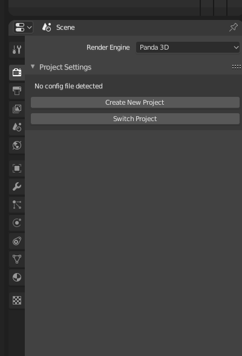
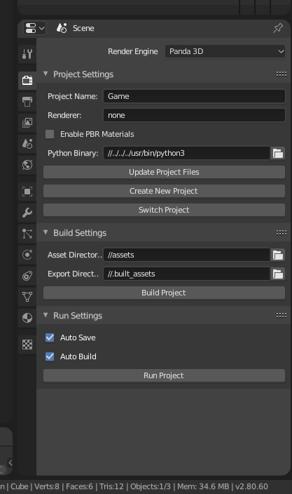

# From https://github.com/Moguri/BlenderPanda

# BlenderPanda
[](https://travis-ci.org/Moguri/BlenderPanda)

Blender addon for integrating [Panda3D](http://www.panda3d.org/)

## Overview
This addon mostly acts as a front-end to [blend2bam](https://github.com/Moguri/panda3d-blend2bam) and [pman](https://github.com/Moguri/pman).

## Features
* BAM export
* Rendered Viewport (preview how Blender scenes will look in Panda)
* Project quick-start (setup common directories and files for your new project)
* Launch your game from inside Blender (launches as a separate application)

## Dependencies
In order to use BlenderPanda, you need to satisfy two dependencies:

* Blender (tested with 2.80)
* Python 3.7+ with `panda3d` installed

The Python install that has `panda3d` installed needs to be on the PATH for BlenderPanda to work.

## Getting Started
Documentation for getting started with BlenderPanda can be found [here](https://blenderpanda.readthedocs.org/en/latest/getting_started.html).
## Installing the Addon
There are two ways to get the addon:

* Download a [release build](https://github.com/Moguri/BlenderPanda/releases)
* Grab the latest version with Git

Using Git is recommended for those that want to quickly get the latest updates.
However, using a release build is easier to install (especially for those not familiar with Git).

### Using a release build
Release builds can be found on the project's [Releases Page](https://github.com/Moguri/BlenderPanda/releases).
The Source Code builds will not contain submodules, so make sure you grab the file that starts with `BlenderPanda-v`.
Once you have the zip file, the addon can be installed like any Blender addon by following the instructions in the [Blender Manual](https://www.blender.org/manual/preferences/addons.html).

### Using Git
GitHub's Download ZIP option does not support git submodules, which are used by BlenderPanda to bring in various dependencies.
Therefore using git is the recommended way to grab the latest version of the addon.
From the user addons directory (e.g., ~/.config/blender/2.xx/scripts/addons on Linux) use the following git command:

```bash
git clone --recursive https://github.com/Moguri/BlenderPanda.git
```

To update to the latest version of the addon run the following from the addon's directory:

```bash
git pull
git submodule update --init --recursive
```

With the addon repository cloned, the addon should now show up in the addons section of Blender's User Preferences and can be enabled from there.
If all has gone well, a Panda3D RenderEngine should now be available.
If the addon has been enabled, but does not show up in the RenderEngine drop down, check the console for errors.

The mostly likely source of errors is not having Panda3D setup correctly.
If, instead, there is an error about not being able to find `pman` or `blend2bam` or one of their submodules, the git repository is likely missing its submodules.
This can happen if the `--recursive` option was not used during `git clone`.
The following git command should bring in the missing submodule(s)::

```bash
git submodule update --init --recursive
```

The `Makefile` in the repository also has an `update_targets` command that can be invoked (via `make update_targets`) that will execute the `git submodule update`.


## Viewport Preview
BlenderPanda is implemented as a Render Engine, so make sure it is selected from the Render Engine dropdown in Blender's info bar.
To preview a scene in Panda3D, simply switch to a rendered viewport.
Depending on the size of the Blender scene, it may take some time to convert to Panda3D.

Rendered Viewport on macOS requires Panda3D 1.10+

## Setting up a pman Project
While some features such as viewport previewing and BAM export are possible without a `pman` project, to make full use of BlenderPanda you'll need to set one up.

To create a new project from scratch (including necessary `pman` files), click on the Create New Project button in the render properties:



This brings up Blender's file dialog allowing you to select a folder to create the new project in.
This will generate a handful of files and directories to get you setup quickly.
This operator will create a new project using [pman](https://github.com/Moguri/pman), specifically `pman create`.
When BlenderPanda detects a project, the render properties are updated:



## Building and Running the Project
The project can be run via the `main.py` as any normal Panda3D application or the Run Project button in the render properties in Blender.

If you have any assets that need to be converted, the Build Project button will convert all items in the asset directory and place them in the export directory (creating it if need be).
When building a project, a source file in the asset directory will only be converted if it has a newer timestamp than the converted file in the export directory.
In other words, only out-of-date assets are converted.

If auto-building is enabled -- which it is by default -- then the project will be built every time the game is run.
This includes running the game from within Blender via BlenderPanda or running `main.py` normally.
The build process is very quick if no assets need to be converted, so auto-building should not hurt iteration times when programming.
However, auto-build is very useful when pulling in new/modified source assets from a version control system.
Therefore, it is recommended to leave auto-building enabled.

When running a project with no changes made to the initial `main.py` created by BlenderPanda/pman, you will be greeted by a window with a boring gray background.
This is because there are no models being loaded in the `main.py`.
After creating and saving a model to the project's assets directory, it can be loaded by adding the following to `GameApp.__init__` in `main.py` somewhere after the `pman.shim.init(self)`::

```python
self.model = self.loader.loadModel('name_of_model_file.bam')
self.model.reparentTo(self.render)
```

Projects using Panda3D 1.10+ may want to use the new API style::

```python
self.model = self.loader.load_model('name_of_model_file.bam')
self.model.reparent_to(self.render)
```

By default, the camera for the Panda3D scene will be at the origin, so it is likely that the loaded model will not be visible.
For information on controlling the camera in Panda3D, please refer to the [Controlling the Camera](https://www.panda3d.org/manual/index.php/Controlling_the_Camera) section of the [Panda3D Manual](https://www.panda3d.org/manual/index.php/Main_Page)

## Project settings
For more information on the various project settings, please refer to the `pman` [documentation](https://github.com/Moguri/pman).

# [B站教程 for Blender2.7](https://www.bilibili.com/video/av50200055)
