ImmunemaG是一个仿免疫系统塔防游戏

ImmunemaG is immune game

<a href="#">
  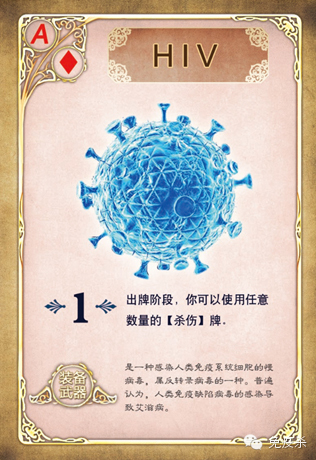
</a>

<a href="#">
  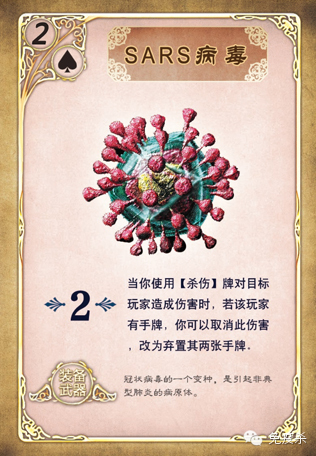
</a>

<a href="#">
  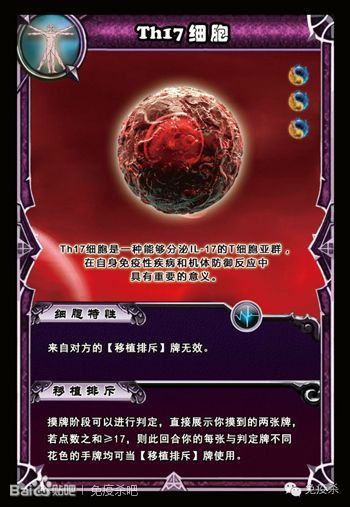
</a>

<a href="#">
  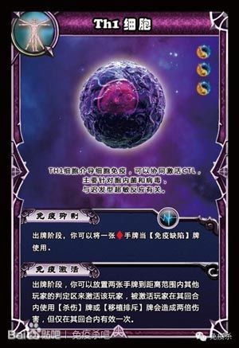
</a>

<a href="#">
  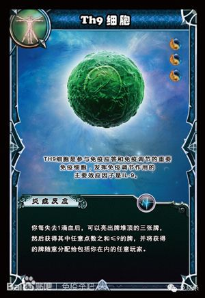
</a>

<a href="#">
  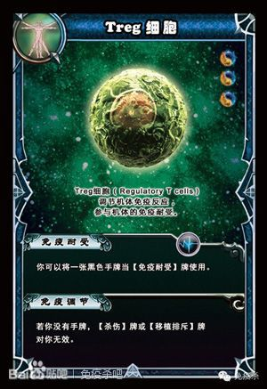
</a>

<a href="#">
  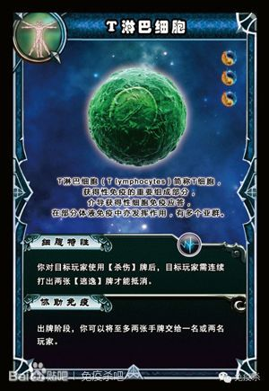
</a>

<a href="#">
  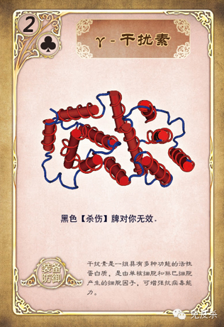
</a>

<a href="#">
  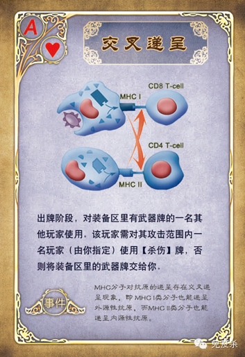
</a>

<a href="#">
  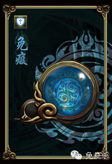
</a>

<a href="#">
  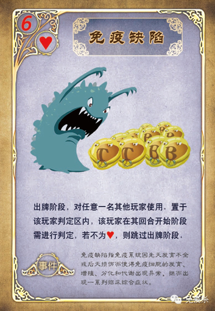
</a>

<a href="#">
  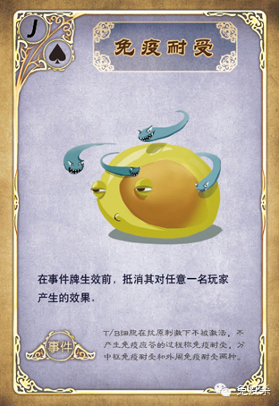
</a>

<a href="#">
  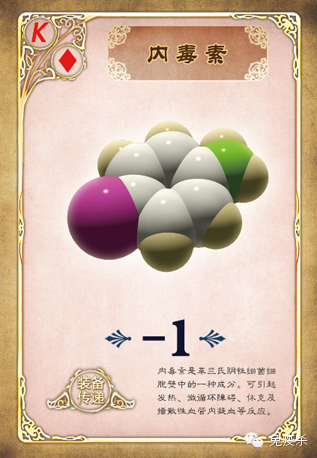
</a>

<a href="#">
  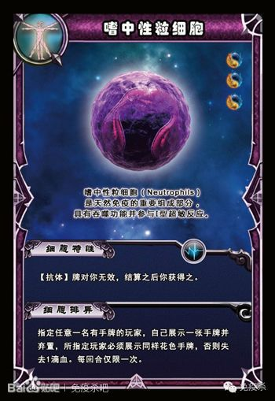
</a>

<a href="#">
  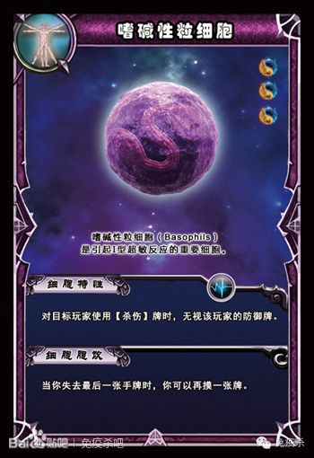
</a>

<a href="#">
  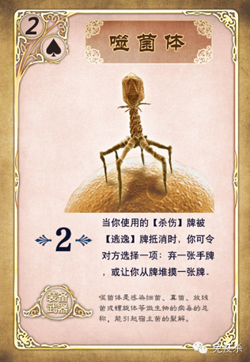
</a>

<a href="#">
  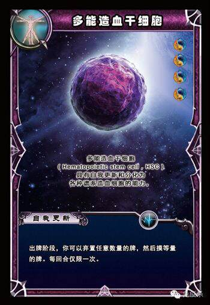
</a>

<a href="#">
  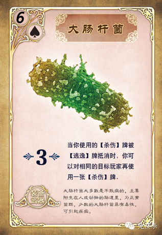
</a>

<a href="#">
  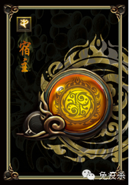
</a>

<a href="#">
  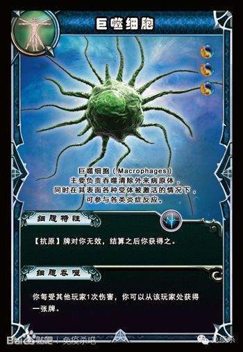
</a>

<a href="#">
  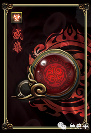
</a>

<a href="#">
  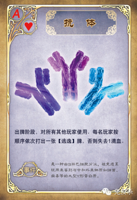
</a>

<a href="#">
  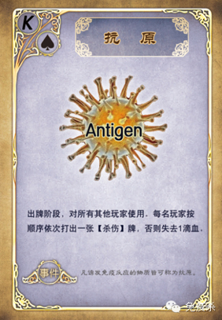
</a>

<a href="#">
  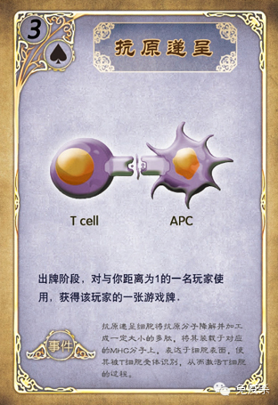
</a>

<a href="#">
  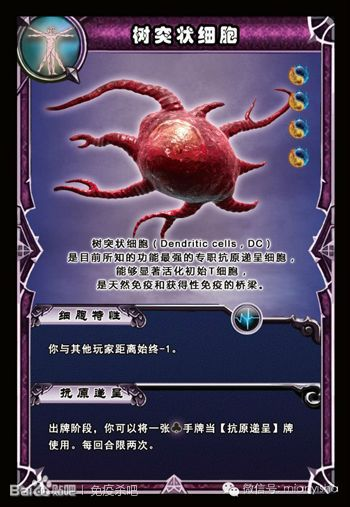
</a>

<a href="#">
  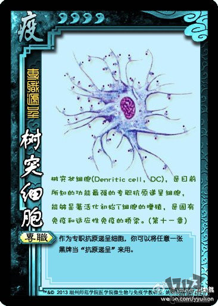
</a>

<a href="#">
  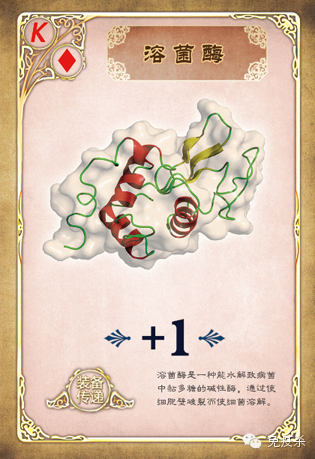
</a>

<a href="#">
  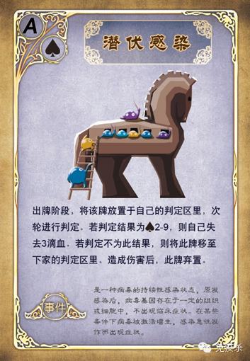
</a>

<a href="#">
  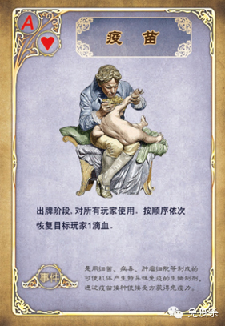
</a>

<a href="#">
  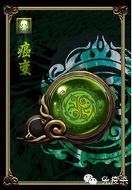
</a>

<a href="#">
  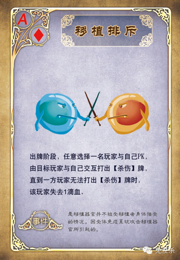
</a>

<a href="#">
  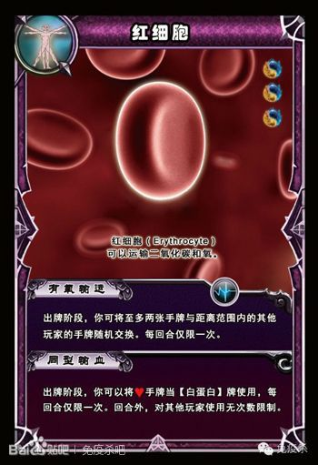
</a>

<a href="#">
  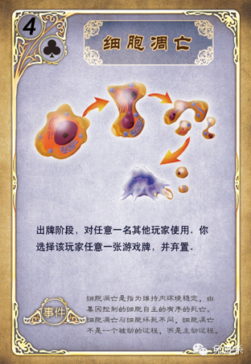
</a>

<a href="#">
  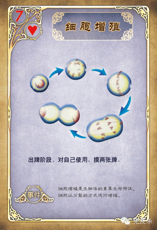
</a>

<a href="#">
  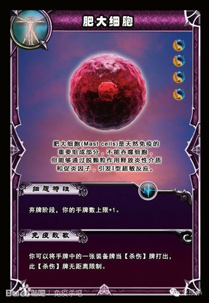
</a>

<a href="#">
  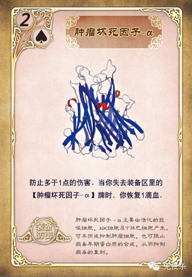
</a>

<a href="#">
  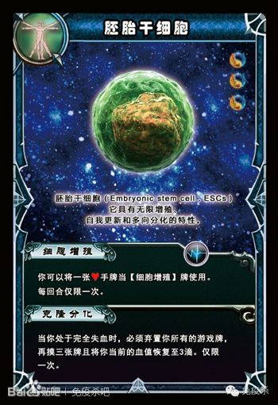
</a>

<a href="#">
  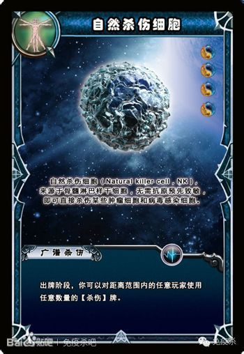
</a>

<a href="#">
  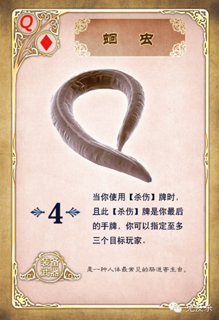
</a>

<a href="#">
  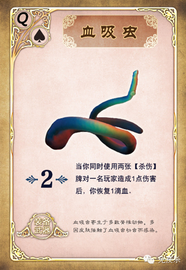
</a>

<a href="#">
  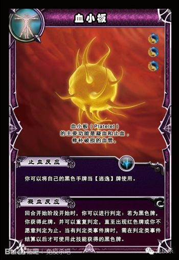
</a>

<a href="#">
  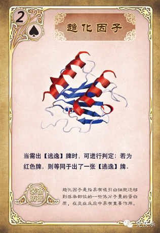
</a>

<a href="#">
  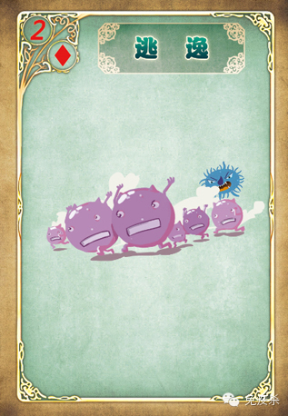
</a>

<a href="#">
  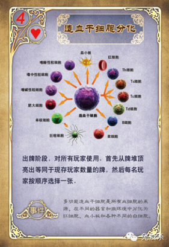
</a>

<a href="#">
  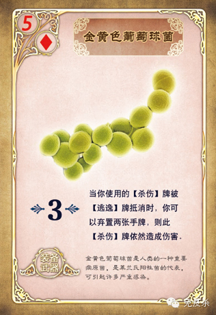
</a>

<a href="#">
  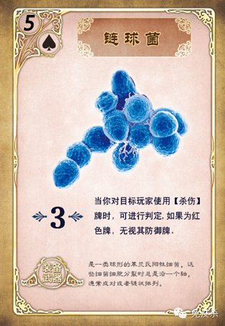
</a>

