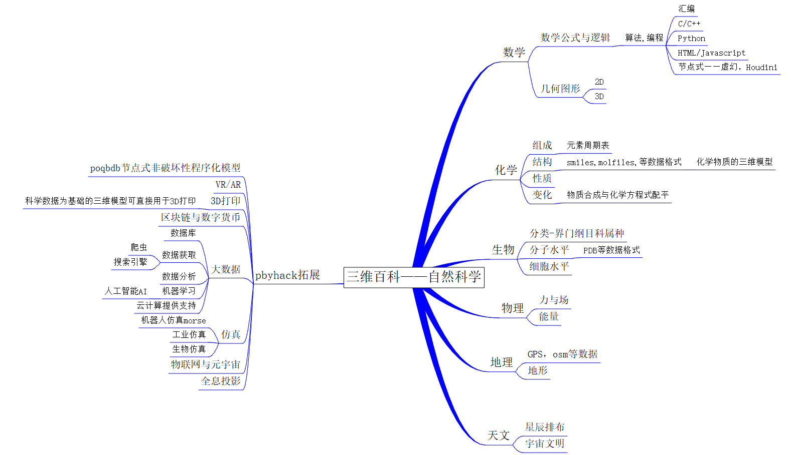

 

# [UnreaLearnbgame项目](UnreaLearnbgame)

# [可玩的demo](https://drive.google.com/drive/folders/1si439h7VgASJHuR1lvfGhs2EVkCAL-9e)

[B站成果/进展/视频展示](https://space.bilibili.com/599592220)

#  :book: Learnbgame ----learnbgame is learn by game

Learnbgame的目标是一个创建一个关于科学知识学习的 :video_game:[3D游戏平台](https://www.learnbgame.com/) :video_game:,将科学研究得到的科学知识进行三维可视化,构建一个科学知识元宇宙，力求创建一种所见即所得的学习方式,你可以理解为现实世界的虚拟仿真映射.这个项目旨在不断迭代构建可行性方案蓝图。

关于[Learnbgame](https://www.bilibili.com/video/BV1kf4y1q7Mp)

## Learnbgame开发路线图式

Learnbgame目标的实现还有很长的路要走,因此会随着不断的迭代会修正不同的施行方案和蓝图，现阶段Learnbgame为依托主流开源虚幻引擎Unreal的3D游戏项目，力求

####    节点式制作
*    模型使用节点式非破坏性程序化模型

*    逻辑采用节点式逻辑

####     趣味性
*  内容自然过渡

####      学习性
*   寓教于乐

## [LearnruT](https://github.com/BlenderCN/Learnbgame/tree/master/LearnruT)为Learnbgame项目实时更新进行时

[Blender3DWorld](https://github.com/Fofight/Blender3DWorld)——————>[All_In_One](https://github.com/FofightFong/All_In_One)————>[Learnrut](https://github.com/FofightFong/Learnrut)————>[UnreaLearnbgame](UnreaLearnbgame)

##  [百科知识元宇宙](https://github.com/BlenderCN/Learnbgame/blob/master/LearnBikiW.md)
     ✡ [数学]()
         |———— ✡  [物理]()
                    |———— ✡ [化学]()
                                |———— ✡  [生物]()
                                          |———— ✡ [地理]()
                                                    |———— ✡ [天文]()

## [节点时代 :memo: All_In_One流程](All_In_One)

参考 PDG PCG将All_In_One流程有机连接在一起

    ✡原画
     |————————✡模型(节点式非破坏性程序化模型)
                |——————————✡材质(程序化材质纹理)
                            |—————————————————✡动画(动作捕捉库)               ✡游戏引擎    
                                               |————————————✡特效(实时解算)     |
                                                             |————————————————✡渲染（实时渲染）
                                                                               |
                                                                             ✡后期合成
                                                                               |
                                                                             ✡视频剪辑
                                                                               
                                                                             

* [节点式非破坏性程序化模型](poqbdb.md)

* 程序化材质纹理----节点实现

* 后期----节点实现

* 节点式逻辑

* [blender]() + [unreal蓝图]() 

###  :memo: poqbdb---- poqbdb is power or quest by database

这是关于Learnbgame世界的数据集合引擎
*   模型的生成主要采用节点式非破坏性程序化模型

##  :book: 模型集成插件UI架构--基于现实世界和科学研究理论进行分类

###  :memo: [物质世界(主要以poqbdb节点式非破坏性程序化模型形式体现)](https://github.com/BlenderCN/Learnbgame/tree/master/poqbdb)

    ✡夸克————✡质子
            |—————✡原子核
           ✡中子      |——————✡原子————✡分子————✡细胞————✡组织————✡器官————✡功能系统————✡个体————✡物种————✡种群————✡群落————✡生态系统——————✡地球————✡太阳系————✡银河系————✡本星系群————✡总星系————✡宇宙——————✡世界
                   ✡电子

从原子出发，有[元素周期表](https://ptable.com/#Properties),往前，有原子核和电子组成的电子云，往后，则是原子通过[化学方程式](https://chemequations.com/zh/)实现构成分子的三维结构，以[smiles](https://github.com/BlenderCN/Learnbgame/blob/master/poqbdb/%E5%88%86%E5%AD%90.md)格式构建分子三维结构，这是个微观世界，

往后，以节点式非破坏性程序化模型形式构建物种，种群组成的生态系统。

再往后，是地球及以外以星球为基的广阔的宇宙。

###  :memo: 生物

atoms---molecules---species---planets---

原子---分子---物种----星球---

:atom: 原子--[元素周期表](https://ptable.com/#Properties)--核外电子排布--

 

:electron:  分子--由元素周期表的化学元素组成(无机物,有机大分子)，通过化学方程式指导物质合成。

:six_pointed_star:   无机物--[smiles](https://github.com/BlenderCN/Learnbgame/blob/master/poqbdb/%E5%88%86%E5%AD%90.md)

✡   有机大分子--[pdb]()--[mol]()

 

:ghost: 物种--界--门--纲--目--科--属--种
</a>
 

:earth_asia: 星球--行星--恒星--星系

 

###  :memo: 地理

由节点式程序化非破坏性流程整合的地理数据驱动的地形

[其他](https://github.com/BlenderCN/Blender3DWorld/blob/master/blender%E6%A8%A1%E5%9E%8B%E5%BA%93.md)

###  :memo: [能量驱动——（主要以特效形式及相应反应逻辑体现LByEFX）](https://github.com/BlenderCN/Learnbgame/tree/master/LByEFX))

:currency_exchange: 物质合成反应

化学反应————化学方程式

声--光--热--电--动--势--场

 :musical_score: [声]()--  

 

:boom: [光]()--材质库(程序纹理材质库)--<a href="">环境光</a>

 

:fire: [热]()--烟--火

 

:zap: [电]()--

 

:nut_and_bolt: [动]()--骨骼--

 

 :anchor: [势]()--状态--液体状态--
</a>
 

:cyclone: [场]()--Force Field()
</a>
 

#  :book: requirement 

Unreal

#  :book: LearnruT----他山之石,可以工玉

# [Learnbgame 在虚幻引擎](UnreaLearnbgame)

* [虚幻商城资源VaultCache](UnreaLearnbgame/VaultCache)

* [Learnbgame in Github with Unreal](https://github.com/all-in-one-unreal/readme)

#  :warning: 注意事项:

*     产品在不断地迭代更新中

# :book:Learnbgame游戏引擎LearnbgamEngine

*   [三维模型————节点式非破坏性程序化模型](poqbdb)

*   [脚本语言/逻辑节点: python :black_large_square: C++  :black_large_square: blueprint ](PByHack.md)

*   [:dizzy: 注释系统]()

*   [物质合成系统](https://github.com/BlenderCN/Learnbgame/blob/master/UnreaLearnbgame/%E7%89%A9%E5%93%81%E5%90%88%E6%88%90%E7%B3%BB%E7%BB%9F.md)

*   [:dizzy:特效系统](https://github.com/BlenderCN/Learnbgame/tree/master/LByEFX)

*   [库存系统](UnreaLearnbgame/库存系统.md)

*   [物理引擎:](UnreaLearnbgame/物理引擎.md)

*   [交易商城系统，拍卖系统](FreetimeJoW)

*   [声音引擎     :sound:](UnreaLearnbgame/声音系统.md)

*   [人工智能AI :computer:](UnreaLearnbgame/人工智能.md)

# :book:other

<a href="Fofight.md">
  
Fofight
</a>
<a href="Lmy.md">
      

Lmy

</a>

 

<a href="Game.md">
  
Game
</a>
<a href="Learn.md">
      

Learn

</a>

 

<a href="poqbdb">
  
poqbdb
</a>
<a href="Learnbgame.md" align="right" align="right">

Learnbgame

</a>

 

<a href="PByHack">

PByHack
</a>
<a href="LearnruT">

LearnruT

</a>

 

<a href="FreetimeJoW.md">

FreetimeJoW
</a>
<a href="LearnioC.md">
  

LearnioC

</a>

 

<a href="All_In_One.md" >
All_In_One

</a>
<a href="LearnW5H.md">
  

LearnW5H

</a>

 

<a href="UnreaLearnbgame.md" >
UnreaLearnbgame

</a>
<a href="LearnbdnelB.md" align="right">

LearnbdnelB

</a>
 

<a href="Fong.md" >
Fong

</a>
<a href="LearnbgameWWW.md" align="right">
 

LearnbgameWWW

</a>
 

<a href="LearnBikiW.md" align="right">
  

LearnBikiW

</a>
 

 
<a href="LByEFX">
  

LByEFX

</a>
 

