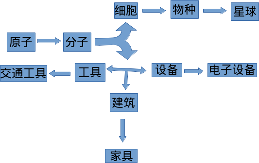
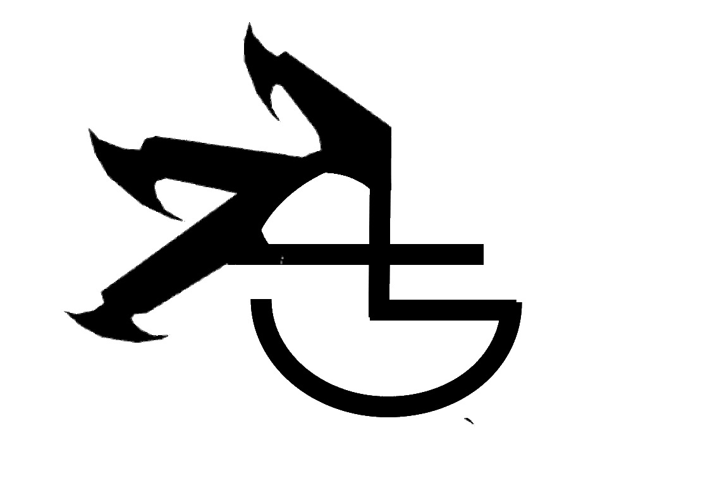

# Learnbgame ----learnbgame is learn by game

#### Addon UI

# 物质世界

这是关于物质世界的模型库集合,模型的生成主要通过算法的生成和[gltf格式](https://github.com/KhronosGroup/glTF)文件的导入.

## struct

### 生物

atoms---molecules---species---planets---

原子---分子---物种----星球---

<a href="#">
  
原子--元素周期表--核外电子排布--
</a>
 

<a href="#">
  
分子--无机物--有机大分子--
</a>
 

<a href="#">
  
无机物--smiles
</a>
 

<a href="#">
  
有机大分子--pdb--mol
</a>
 

<a href="#">
  
物种--界--门--纲--目--科--属--种
</a>
 

<a href="#">
  
星球--
</a>
 

[其他](https://github.com/BlenderCN/Blender3DWorld/blob/master/blender%E6%A8%A1%E5%9E%8B%E5%BA%93.md)

# 能量驱动

声--光--热--电--动--势--场

<a href="#">
  
声--
</a>
 

<a href="#">
  
光--材质库(blender有内置材质库)--<a href="http://codeofart.com/easy-hdri-0-9-0/">环境光easyhdri</a>
</a>
 

<a href="#">
  
热--
</a>
 

<a href="#">
  
电--
</a>
 

<a href="#">
  
动--
</a>
 

<a href="#">
  
势--
</a>
 

<a href="#">
  
场--Force Field(blender内置)
</a>
 

# requirement 

blender 2.8+
openbabel

# 注意事项:

目前由于插件中的分子生成部分需要调用openbabel化学python库,所以还需另外安装,日后会进行改进,敬请期待

atom模块中电子的运动是绕着x或y或z轴旋转的,并非绕原点旋转,关于绕原点的算法暂时还没有思路,有待改进.

插件目前主要在kali linux系统中开发,所以可能会有兼容性问题,欢迎提[bug](https://github.com/BlenderCN/Learnbgame/issues)

<a href="Fofight.md">
  
Fofight
</a>
 
<a href="ImmunemaG.md">
  
ImmunemaG
</a>
 
<a href="LearmWWW.md">
  
LearmWWW
</a>
 
<a href="LearnbdnelB.md">
  
LearnbdnelB
</a>
 
<a href="Learnbgame.md">
  
Learnbgame
</a>
 
<a href="LearnbgameWWW.md">
  
LearnbgameWWW
</a>
 
<a href="LearnBikiW.md">
  
LearnBikiW
</a>
 
<a href="LearnioC.md">
  
LearnioC
</a>
 
<a href="LearnruT">
  
LearnruT.md
</a>
 
<a href="LearnW5H.md">
  
LearnW5H
</a>
 
<a href="PByHack.md">
  
PByHack
</a>
 
<a href="poqbdb.md">
  
poqbdb
</a>

