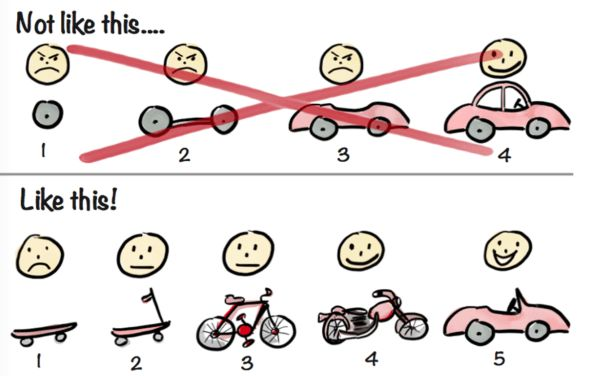
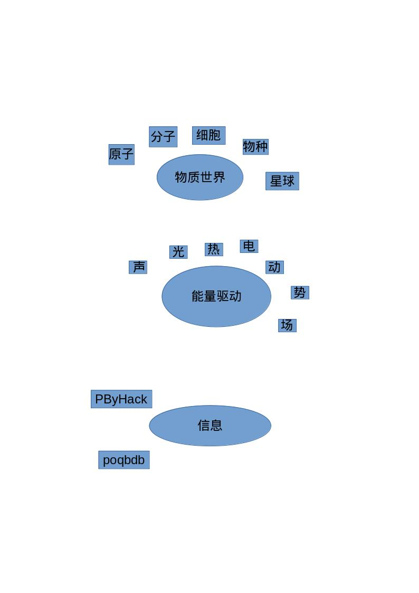
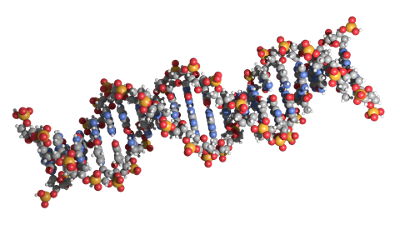
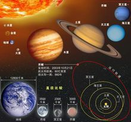
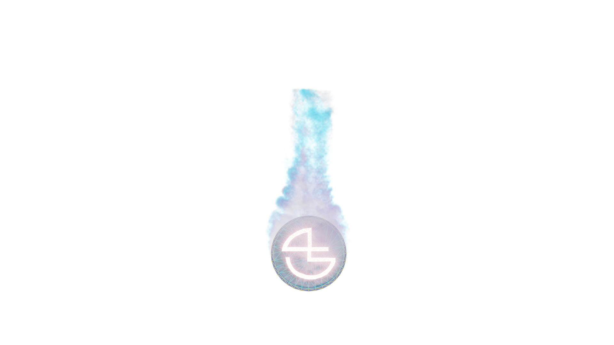
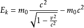
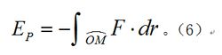
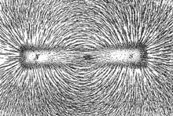

# Learnbgame ----learnbgame is learn by game

Learnbgame的目标是一个创建一个关于科学知识学习的[AR/VR游戏](),将科学研究得到的科学知识进行三维可视化,力求创建一种所见即所得的学习方式,你可以理解为现实世界的虚拟仿真映射.

关于[Learnbgame](https://www.bilibili.com/video/av53908817)

## Learnbgame开发路线图式

Learnbgame目标的实现还有很长的路要走,因此现阶段Learnbgame为依托[Blender](https://www.blender.org/)三维软件开发三维模型集成插件,插件集成开源的模型生成插件算法和脚本,力求

* 一键生成模型

* 灵活自定义模型

* 批量生成高级可观模型

* 创建基于现实的模型

* 灵活管理模型

### 插件效果演示

### poqbdb

这是关于物质世界的模型库集合,模型的生成主要通过算法的生成和[gltf格式](https://github.com/KhronosGroup/glTF)文件的导入.

### [ImmunemaG](ImmunemaG.md)

这是关于免疫学知识的卡牌游戏

### All_In_One
*	收集来源于github上的blender的插件集合,目前共计1825枚插件/脚本----[ing](All_In_One/README.md)

*	计划会编写一个检测github平台上和blender有关的插件和脚本的爬虫脚本,以实时追踪blender的最新动向

*	未整理的托管于[BlenderCN-Org](https://github.com/BlenderCN-Org),共计1845枚.

### 目前集成开源[插件列表](LearnbdnelB.md)

# 模型集成插件UI架构--基于现实世界和科学研究理论进行分类

	架构树结构
        ├── 信息
        │   ├── PByHack
        │   │   ├── blender
        │   │   ├── html
        │   │   ├── javascript
        │   │   ├── kali linux
        │   │   └── python
        │   └── 大数据
        │       ├── 数据分析
        │       │   ├── 机器学习
        │       │   └── 自然语言处理
        │       ├── 数据库
        │       │   └── poqbdb
        │       └── 数据获取
        │           └── 爬虫
        ├── 物质世界
        │   ├── 分子
        │   │   └── 化合物
        │   │       ├── blender_pdb
        │   │       └── openbabel_smiles
        │   ├── 原子
        │   │   ├── 元素周期表
        │   │   └── 电子轨道
        │   ├── 星球
        │   │   ├── 地球内
        │   │   │   ├── 工具
        │   │   │   │   └── 交通工具
        │   │   │   ├── 建筑
        │   │   │   │   └── 家具
        │   │   │   └── 设备
        │   │   │       └── 电子设备
        │   │   └── 地球外
        │   ├── 物种
        │   │   ├── 属
        │   │   │   ├── 牛属
        │   │   │   └── 犬属
        │   │   ├── 界
        │   │   │   ├── 动物
        │   │   │   ├── 微生物
        │   │   │   └── 植物
        │   │   ├── 目
        │   │   │   ├── 偶蹄目
        │   │   │   ├── 啮齿目
        │   │   │   ├── 灵长目
        │   │   │   └── 食肉目
        │   │   ├── 种
        │   │   ├── 科
        │   │   │   ├── 熊科
        │   │   │   ├── 犬科
        │   │   │   ├── 猫科
        │   │   │   └── 鲤科
        │   │   ├── 纲
        │   │   │   ├── 哺乳纲
        │   │   │   └── 昆虫纲
        │   │   └── 门
        │   │       ├── 脊索动物门
        │   │       ├── 苔藓植物
        │   │       ├── 蕨类植物
        │   │       ├── 被子植物
        │   │       └── 裸子植物
        │   └── 细胞
        │       └── 神经细胞
        └── 能量驱动
            ├── 光
            │   ├── 材质
            │   │   └── 材质库
            │   └── 环境光
            │       └── hdr
            ├── 动
            │   └── 骨骼
            ├── 势
            │   └── 状态
            │       ├── 固
            │       │   └── 硬表面
            │       ├── 气
            │       │   └── 粒子
            │       └── 液
            │           └── 流体
            ├── 场
            │   ├── 重力场
            │   └── 风
            ├── 声
            │   ├── 声音库
            │   └── 音效可视化
            ├── 热
            │   ├── 冰
            │   └── 火
            └── 电
                └── 闪电

### 物质世界

    夸克————质子
            |—————原子核
           中子      |——————原子————分子————细胞————组织————器官————功能系统————个体————物种————种群————群落————生态系统——————地球————太阳系————银河系————本星系群————总星系————宇宙——————世界
                   电子

从原子出发，有元素周期表,往前，有原子核和电子组成的电子云，往后，则是原子构成分子的三维结构，以pdb和smiles格式在blender中，这是个微观世界，

往后，以gltf格式,是物种，种群组成的生态系统。

再往后，是地球以外广阔的宇宙。

### 生物

atoms---molecules---species---planets---

原子---分子---物种----星球---

<a href="#">
  
原子--元素周期表--核外电子排布--
</a>
 

<a href="#">
  
分子--无机物--有机大分子--
</a>
 

<a href="#">
  
无机物--smiles
</a>
 

<a href="#">
  
有机大分子--pdb--mol
</a>
 

<a href="#">
  
物种--界--门--纲--目--科--属--种
</a>
 

<a href="#">
  
星球--
</a>
 

[其他](https://github.com/BlenderCN/Blender3DWorld/blob/master/blender%E6%A8%A1%E5%9E%8B%E5%BA%93.md)

### 能量驱动

声--光--热--电--动--势--场

<a href="#">
  
声--
</a>
 

<a href="#">
  
光--材质库(blender有内置材质库)--<a href="http://codeofart.com/easy-hdri-0-9-0/">环境光easyhdri</a>
</a>
 

<a href="#">
  
热--
</a>
 

<a href="#">
  
电--
</a>
 

<a href="#">
  
动--骨骼--
</a>
 

<a href="#">
  
势--状态--液体状态--<a href="https://github.com/rlguy/Blender-FLIP-Fluids">FLIP Fluids</a>
</a>
 

<a href="#">
  
场--Force Field(blender内置)
</a>
 

# requirement 

blender 2.8+
openbabel

# 注意事项:

* 目前由于插件中的化学分子三维结构生成部分需要调用openbabel化学python库,所以还需另外安装,日后会进行改进,敬请期待

* atom模块中电子的排布引用Fibonacci lattice算法,运动引用AXIS ANGLE旋转算法.

* 插件目前主要在kali linux系统中开发,所以可能会有系统兼容性问题,欢迎提[bug](https://github.com/BlenderCN/Learnbgame/issues)

# 插件安装

将插件目录[learnbgame](https://github.com/BlenderCN/Learnbgame/tree/master/learnbgame)压缩,即可从blender-2.8安装,插件[目录结构树](Learnbgame.md)

# Learnbgame游戏引擎LearnbgamEngine

*   三维模型--专注于[gltf](https://github.com/KhronosGroup/glTF)格式

*   脚本语言:专注于python

*   依托blender平台eevee引擎

*   注释系统

*   特效系统

*   物理引擎

*   声音引擎

*   人工智能

借鉴[BlenderPanda引擎](https://github.com/Moguri/BlenderPanda)----[UPBGE引擎](https://github.com/UPBGE/blender)

# other

<a href="Fofight.md">
  
Fofight
</a>
 
<a href="ImmunemaG.md">
  
ImmunemaG
</a>
 
<a href="LearmWWW.md">
  
LearmWWW
</a>
 
<a href="LearnbdnelB.md">
  
LearnbdnelB
</a>
 
<a href="Learnbgame.md">
  
Learnbgame
</a>
 
<a href="LearnbgameWWW.md">
  
LearnbgameWWW
</a>
 
<a href="LearnBikiW.md">
  
LearnBikiW
</a>
 
<a href="LearnioC.md">
  
LearnioC
</a>
 
<a href="LearnruT.md">
  
LearnruT.md
</a>
 
<a href="LearnW5H.md">
  
LearnW5H
</a>
 
<a href="PByHack.md">
  
PByHack
</a>
 
<a href="poqbdb.md">
  
poqbdb
</a>

