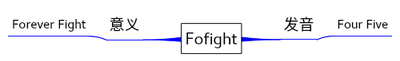

# [Learnbgame](http://www.learnbgame.com/)
Learnbgame是一种理念，即Learn by Game，我希望学习的过程应该是自然的，自由的，直观的，并且是富有乐趣的。
Learnbgame面向所有人开放，每个人，每个组织都可以通过合适的方式参与进来，自由参与，自由退出，但是，这并不意味着你可以为所欲为，自由是所追求的，混乱是所不想看到的。

# 开发模式

第一种模式适合开源合作开发——[项目大框架](项目大框架.md),也许就目前来说这个方案不是最佳的解决方案，但这是我目前所能执行的较简便的可行方案，未来有更合适的方案再进行修正

第二种开发模式适合于独立地开发，目前也是我正在做的——[项目前期计划](项目前期计划.md)

由于现实之中的资金，技术等问题，所以目前还是很缓慢，敬请期待

# 关于[Fofight](Fofight.md):
	Forever Fight<——Fofight——>45——>Four Five

## FofighThink——不可能？不，可能

## 经验/原则

All in one

*	注释系统

*	特效系统.

*	节点非破坏式模型库系统

*	实时性