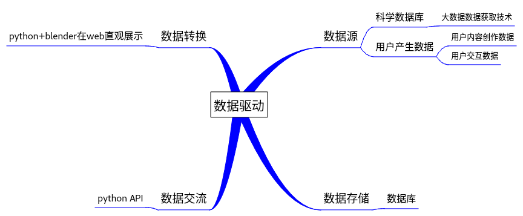

# 现在大框架心里已经有了一个雏形了,以此为方向标进行相应的完善,由于现在还是突发灵感然后记录下来,所以显得很乱和碎片化,以后会改变的....

[相关参考](https://www.bilibili.com/video/av53908817)

面向自然语言

数学——数学公式，逻辑，程序，算法

物理——PBR(Physically Based Rendering)引擎，基于与现实世界的物理原理更相符的基本理论,可以直接以物理参数为依据来编写光，声等效果——[blender](http://blender.org/)

化学——由[元素周期表](https://www.ptable.com/)确定物质组成，由[smiles](http://opensmiles.org/spec/open-smiles.html)，[molfiles](https://www.chemicalbook.com/Search.aspx)等数据构建三维化学结构，由配平的化学方程式实现的化学物质合成反应

生物——用[PDB](https://www.rcsb.org/)等文件格式建立DNA等生物大分子三维模型

地理——结合GPS，[OSM](http://www.openstreetmap.org/)等数据建立三维地形，立体城市

天文——宇宙景观，星球排布

项目目标：
	降低技术门槛，制定简单规则，使用户可以参与内容创作，但基于科学内容的客观性和权威性，拟定使用区块链技术思想进行约束。

实现流程all_in_one：

#### 需求分层，内容分级：
	二维体验
	三维体验
	三维场景交互式体验
	全息投影交互式体验
	VR/AR交互式沉浸体验
	
项目生存——项目盈利——项目可持续发展

#### 项目创作迭代，从文字内容到交互，方向不变，吸引不同的用户
	启蒙教育学生
	基础教育学生
	高等教育学生
	科学普及用户
	教学型老师
	科研型师生
	娱乐型学习
	集中型学习
	自然科学
	自然科学以外的其他学科

#### 业务逻辑，商业模式
	教学内容三维直观化需求服务
	工业生产3D打印模型原型服务
	宣传展示内容三维特效需求服务
	相关技术有偿教学培训服务
	技术文档型纸质书籍销售
	定制性开发，技术支持合作服务
	真实性产品广告宣传服务
	定制性3D打印纪念品的销售服务

#### 团队组建
	管理决策
	法律咨询，相关政策研究
	技术开发，研发
	人力资源，质量监督
	营销推广
	财务管理

# 技术层面

## 技术层目标：
	原子性
	自动化
	高效性
	分布式

## 数据驱动：

### 数据源

### 数据存储——数据库

### 数据转换:数据库——>python调用数据——>blender——>www

## 仅面向浏览器，开发网络应用程序
	这能很大程度上减少针对各平台，各操作系统多次开发的工作量，但同时也会遇到很多问题，诸如浏览器兼容性，平台不独立(这个问题也可以换个思路解决，即绑定浏览器单独发布)

# 用户参与
	众包模式

# 技术驱动

# 

# 模型----节点非破坏式程序化模型
